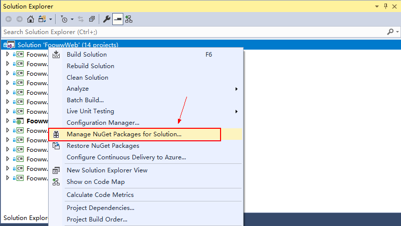
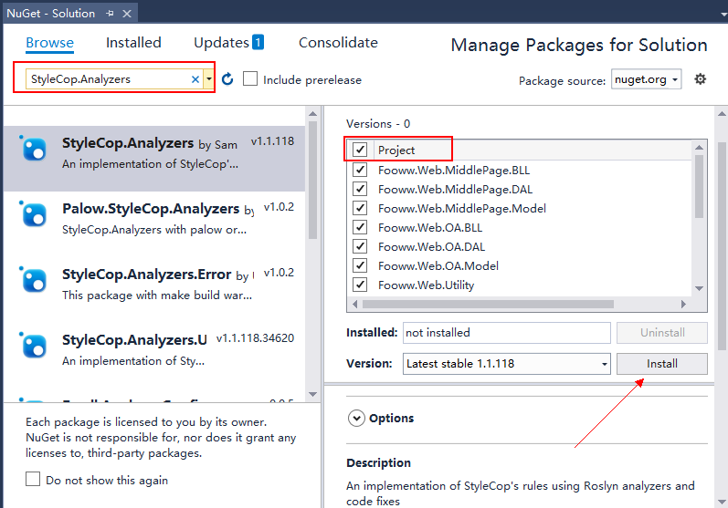
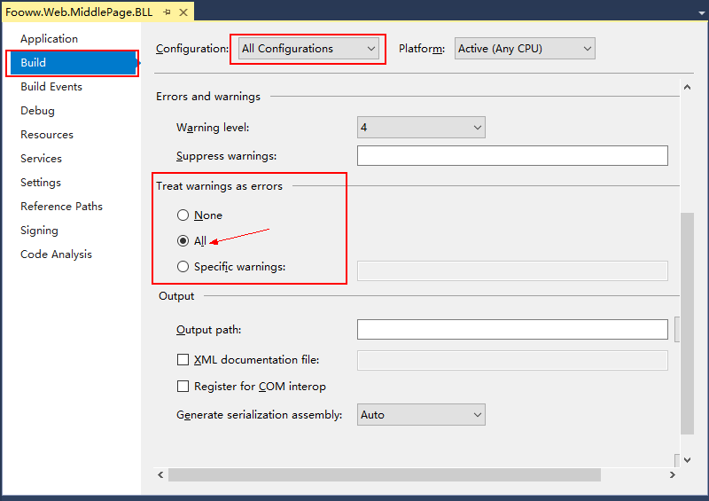
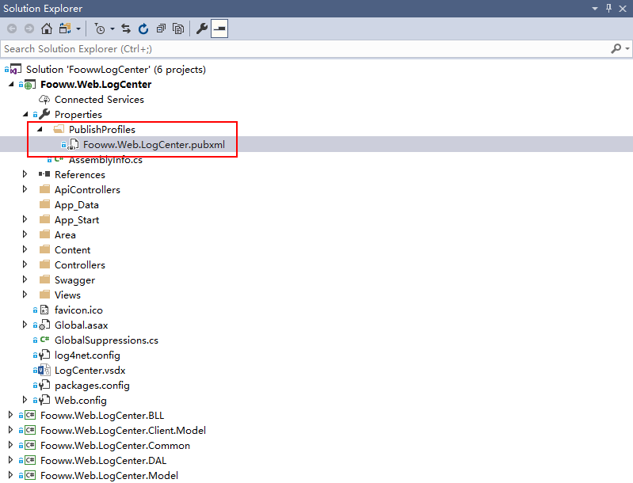
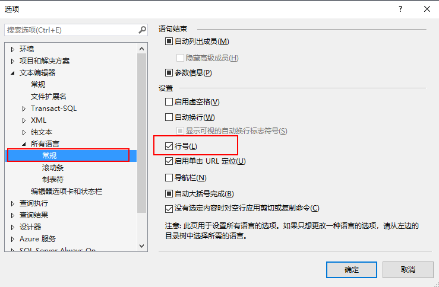
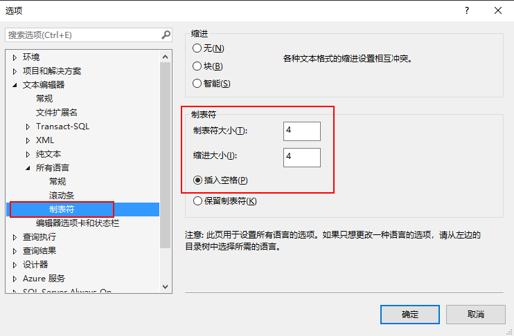
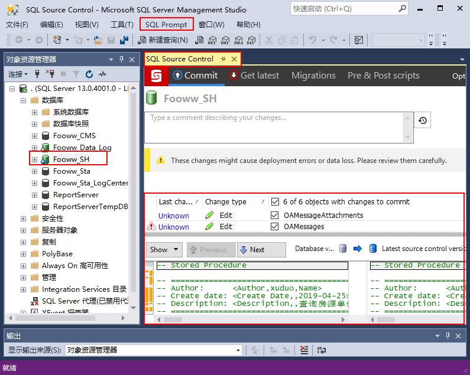

# IDE

统一严格执行如下环境设置

- [IDE](#IDE)
  - [Visual Studio 2017](#Visual-Studio-2017)
    - [Code Analysis](#Code-Analysis)
      - [step 1: Install `StyleCop.Analyzers`](#step-1-Install-StyleCopAnalyzers)
      - [step 2: Treat warnings as errors](#step-2-Treat-warnings-as-errors)
      - [step 3: SuppressMessage](#step-3-SuppressMessage)
      - [step 4: cleanup and simplify](#step-4-cleanup-and-simplify)
    - [Git Hooks](#Git-Hooks)
      - [step 1: pre-push](#step-1-pre-push)
      - [step 2: pre-push.psl](#step-2-pre-pushpsl)
      - [step 3: post-build.psl](#step-3-post-buildpsl)
      - [step 4: set ExecutionPolicy](#step-4-set-ExecutionPolicy)
    - [Copy DocumentXml When Publishing](#Copy-DocumentXml-When-Publishing)
      - [step 1: open pubxml](#step-1-open-pubxml)
      - [step 2: edit pubxml](#step-2-edit-pubxml)
  - [Sql Server Management Studio 17](#Sql-Server-Management-Studio-17)
    - [Line Number](#Line-Number)
    - [Tab](#Tab)
    - [red-gate](#red-gate)

## Visual Studio 2017

### Code Analysis

#### step 1: Install `StyleCop.Analyzers`

统一使用 [StyleCop.Analyzers](https://github.com/DotNetAnalyzers/StyleCopAnalyzers) 来分析代码，强制执行代码规范



解决方案下的`所有项目`都安装



#### step 2: Treat warnings as errors



#### step 3: SuppressMessage

在每个项目根下新建`GlobalSuppressions.cs`

结合团队实际情况，排除以下检查项:

```csharp
[assembly: System.Diagnostics.CodeAnalysis.SuppressMessage("StyleCop.CSharp.ReadabilityRules", "SA1124:Do not use regions", Justification = "Reviewed")]
[assembly: System.Diagnostics.CodeAnalysis.SuppressMessage("StyleCop.CSharp.ReadabilityRules", "SA1123:Do not place regions within elements", Justification = "Reviewed.")]
[assembly: System.Diagnostics.CodeAnalysis.SuppressMessage("StyleCop.CSharp.ReadabilityRules", "SA1108:BlockStatementsMustNotContainEmbeddedComments", Justification = "Reviewed.")]
[assembly: System.Diagnostics.CodeAnalysis.SuppressMessage("StyleCop.CSharp.OrderingRules", "SA1202:ElementsMustBeOrderedByAccess", Justification = "Reviewed.")]
[assembly: System.Diagnostics.CodeAnalysis.SuppressMessage("StyleCop.CSharp.OrderingRules", "SA1200:UsingDirectivesMustBePlacedWithinNamespace", Justification = "Reviewed.")]
[assembly: System.Diagnostics.CodeAnalysis.SuppressMessage("StyleCop.CSharp.NamingRules", "SA1311:StaticReadonlyFieldsMustBeginWithUpperCaseLetter", Justification = "Reviewed.")]
[assembly: System.Diagnostics.CodeAnalysis.SuppressMessage("StyleCop.CSharp.NamingRules", "SA1310:Field names should not contain underscore", Justification = "Reviewed.")]
[assembly: System.Diagnostics.CodeAnalysis.SuppressMessage("StyleCop.CSharp.NamingRules", "SA1309:FieldNamesMustNotBeginWithUnderscore", Justification = "Reviewed.")]
[assembly: System.Diagnostics.CodeAnalysis.SuppressMessage("StyleCop.CSharp.DocumentationRules", "SA1633:FileMustHaveHeader", Justification = "Reviewed.")]
[assembly: System.Diagnostics.CodeAnalysis.SuppressMessage("StyleCop.CSharp.DocumentationRules", "SA1629:Documentation text should end with a period", Justification = "Reviewed.")]
[assembly: System.Diagnostics.CodeAnalysis.SuppressMessage("StyleCop.CSharp.DocumentationRules", "SA1623:PropertySummaryDocumentationMustMatchAccessors", Justification = "Reviewed.")]
```

`PS` :

> `SuppressMessage`是团队行为。团队个人想要`SuppressMessage`需要由团队所有成员统一商议决定。

#### step 4: cleanup and simplify

[codemaid Home](http://www.codemaid.net/)

[Marketplace](https://marketplace.visualstudio.com/items?itemName=SteveCadwallader.CodeMaid)

An open source Visual Studio extension to cleanup and simplify C#, C++, F#, VB, PHP, PowerShell, R, JSON, XAML, XML, ASP, HTML, CSS, LESS, SCSS, JavaScript and TypeScript coding.

`PS` :
> 这个工具提供一些 cleanup and simplify 功能。装上后，可帮助消息警告信息。

### Git Hooks

利用[MSBuild](https://docs.microsoft.com/zh-cn/visualstudio/msbuild/msbuild?view=vs-2017)在Push之前做最后的检查

#### step 1: pre-push

团队`所有成员`, 在`所有git项目`下：

复制[hooks/pre-push](./hooks/pre-push)文件到.git同级目录，并上库

#### step 2: pre-push.psl

建项目时：

复制[hooks/pre-push.psl](./hooks/pre-push.psl)文件到.git同级目录，并上库

#### step 3: post-build.psl

复制[hooks/post-build.psl](./hooks/post-build.psl)文件到`解决方案`中的`起始项目`的根目录中，并上库

再添加以下command line

```powershell
# Project Properties ---> Build Events --> Post build event command line:
powershell -ExecutionPolicy ByPass -File "..\post-build.ps1"
```

#### step 4: set ExecutionPolicy

```powershell
# 以管理员身份运行powershell, 并执行以下语句
Set-ExecutionPolicy RemoteSigned
```

### Copy DocumentXml When Publishing

适用于Web项目在发布时需要将DocumentXml同步复制到bin目录

#### step 1: open pubxml



#### step 2: edit pubxml

```xml
<?xml version="1.0" encoding="utf-8"?>
<!--
This file is used by the publish/package process of your Web project. You can customize the behavior of this process
by editing this MSBuild file. In order to learn more about this please visit https://go.microsoft.com/fwlink/?LinkID=208121. 
-->
<Project ToolsVersion="4.0" xmlns="http://schemas.microsoft.com/developer/msbuild/2003">
  <PropertyGroup>
    <!-- 每个项目的属性 -->
  </PropertyGroup>
  <!-- add start -->
  <ItemGroup>
    <ContentDocumentXML Include="$(MSBuildProjectDirectory)\bin\*.xml"></ContentDocumentXML>
  </ItemGroup>
  <Target Name="PublishDocumentXML" AfterTargets="CopyAllFilesToSingleFolderForPackage">
    <Copy SourceFiles="@(ContentDocumentXML)" DestinationFolder="$(WebProjectOutputDir)\$(WPPAllFilesInSingleFolder)\bin" />
  </Target>
  <!-- add end -->
</Project>
```

## Sql Server Management Studio 17

### Line Number



### Tab



### [red-gate](https://www.red-gate.com/products/)

`可选安装`

SQL Prompt: Write, format, and refactor SQL effortlessly

SQL Source Control: Connect your databases to your source control system


